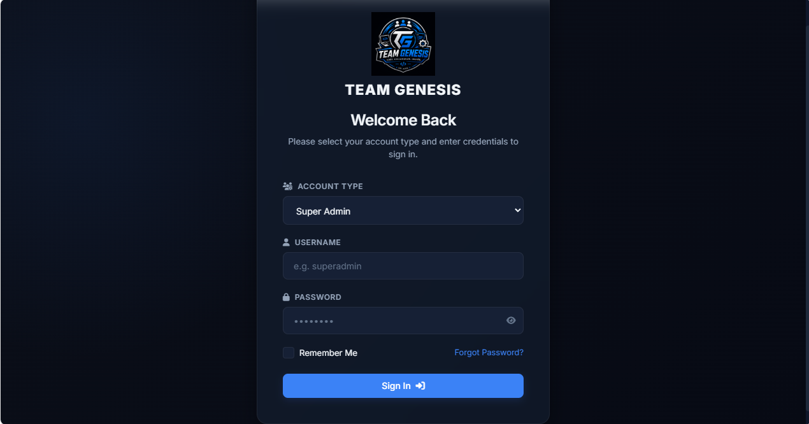
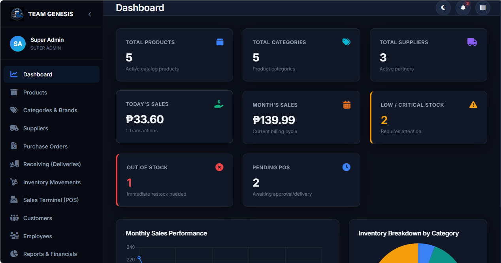
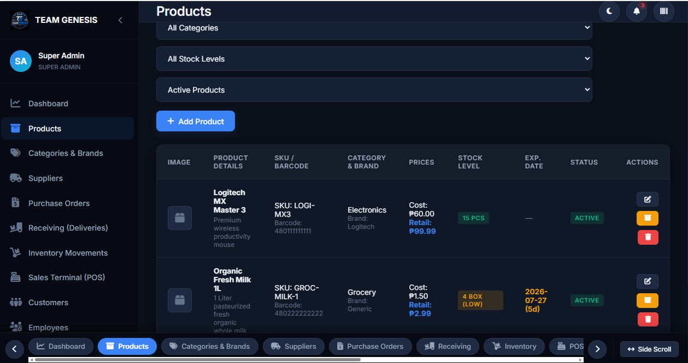
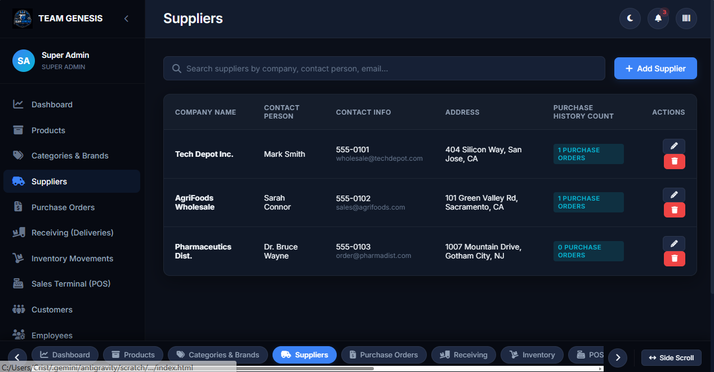
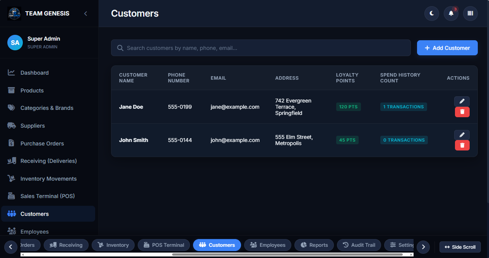
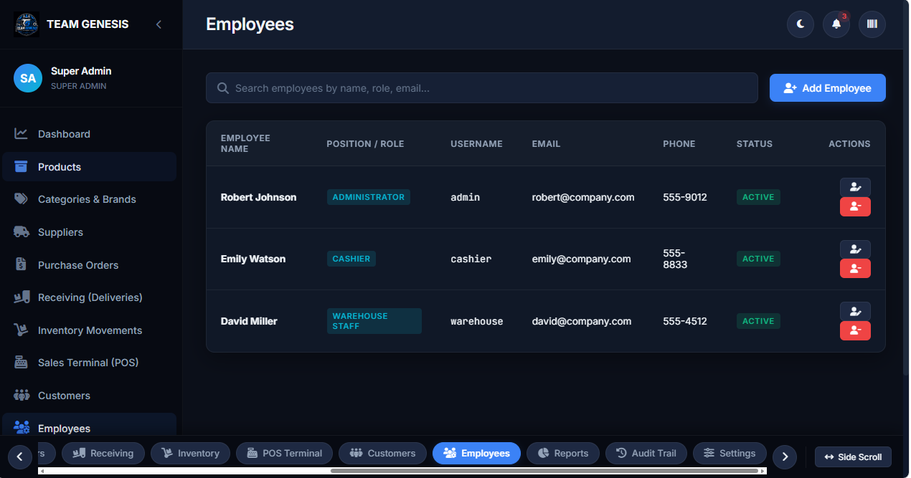
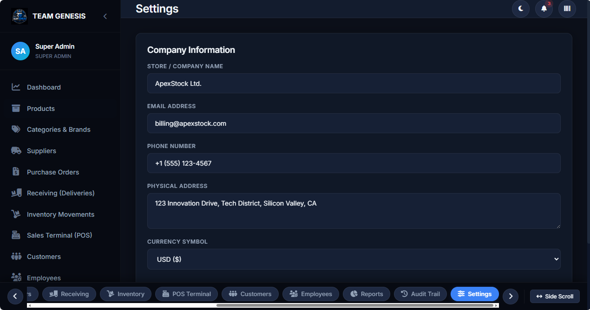

# Inventory-Management-System
## Project Description
The Inventory Management System is a web-based application designed to help businesses efficiently manage their inventory operations. It provides tools for managing products, categories, brands, suppliers, customers, employees, purchase orders, stock movements, and sales transactions. The system also generates inventory and sales reports, tracks audit logs, and monitors stock levels to improve accuracy, reduce manual work, and support better business decision-making.

## 👥 Team Members

| Name | Role | Responsibilities |
|------|------|------------------|
| **Cristian Pacunla Timtim** | Repository Lead | Managed the GitHub repository, reviewed and merged pull requests, coordinated team collaboration. |
| **Eric Gabriel Penkian Diola** | Board Lead | Managed the GitHub Project Board, created and organized issues, and tracked task progress. |
| **Clint James Ayop Dagangon** | Scribe | Prepared project documentation, user stories, backlog, and meeting notes. |
| **Roderick Dayham Andoy** | Builder | Developed project features, implemented assigned tasks, and contributed code. |
| **Christian Caderao Dheb Nebria** | Builder | Developed project features, implemented assigned tasks, and contributed code. |

🎯 Objectives
Simplify inventory management.
Reduce manual record keeping.
Monitor stock levels in real time.
Improve inventory accuracy.
Generate reports for business decisions.

## ✨ Features

### 📦 Product Management
- Add new products
- View product list
- Update product information
- Delete products
- Search and filter products

### 🏷️ Categories & Brands
- Manage product categories
- Manage product brands

### 🚚 Supplier Management
- Add suppliers
- Update supplier information
- Delete suppliers
- View supplier records

### 📥 Inventory Management
- Stock In (Receiving Deliveries)
- Stock Out (Sales/Usage)
- Track inventory movements
- Automatic stock quantity updates
- Low-stock notifications

### 🛒 Purchase Orders
- Create purchase orders
- View purchase order history
- Update purchase order status

### 💰 Sales Terminal (POS)
- Process customer sales
- Generate receipts
- Record payment methods

### 👥 Customer Management
- Manage customer information
- View customer purchase history

### 👨‍💼 Employee Management
- Manage employee accounts
- Assign system roles

### 📊 Reports & Analytics
- Inventory reports
- Sales reports
- Purchase reports
- Stock movement reports
- Low-stock reports

### 🔒 Audit Trail
- Record user activities
- View system logs

### ⚙️ System Settings
- Manage system settings
- Configure business information

  
### DATABASE
The application currently uses an offline-first Browser localStorage Database Engine:

📊 How It Works
Storage Layer: All system records (Products, Categories, Suppliers, Purchase Orders, Stock Movements, Sales, Customers, Employees, Audit Trail, and Settings) are stored as structured JSON in the browser's localStorage.
Persistence: Your data automatically persists across browser refreshes, tab closes, and computer restarts without requiring an external database server to be installed.
Backup & Restore: Under Settings -> Backup Database, you can export your entire database as a .json file anytime and restore/import it onto any computer.

📷 Screenshots

## 📷 System Screenshots

| Login | Dashboard |
|-------|-----------|
|  |  |

| Products | Categories & Brands |
|----------|----------------------|
|  |  |

| Suppliers | Purchase Orders |
|-----------|-----------------|
|  |  |

| Receiving (Deliveries) | Inventory Movements |
|------------------------|---------------------|
| .png) |  |

| Sales Terminal (POS) | Customers |
|----------------------|-----------|
| .png) |  |

| Employees | Reports & Financials |
|-----------|----------------------|
|  |  |

| Audit Trail | Settings |
|-------------|----------|
|  |  |
